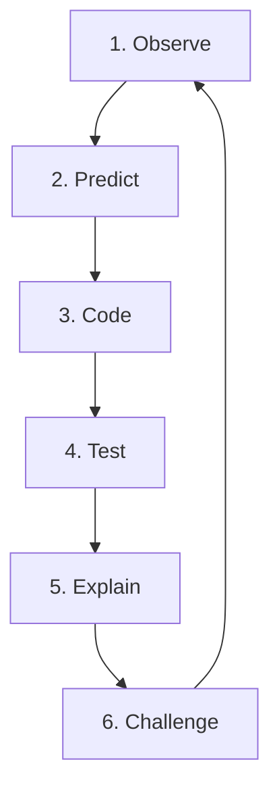

# Teachers' Guide: Star Hopper Physics Lab 🏫

Star Hopper is a zero-setup, open-source 2D physics simulation environment that integrates programming, mathematics, and Newtonian mechanics. It is designed for students in grades 3-8 (ages 8-14) and aligns with Next Generation Science Standards (NGSS).

---

## 🛰️ The Star Hopper Pedagogical Framework
Every level incorporates a **6-Step Cognitive Cycle** mapped to the scientific method:

1. **Observe**: Students identify spatial/physical limitations on the active level (e.g. wall height, gap size).
2. **Predict**: Students hypothesize which physics constants (gravity, friction, velocity) must change to overcome the challenge.
3. **Code**: Students write explicit modifications in KidCode (e.g. `gravity = 0.1` or `friction = 0`).
4. **Test**: Students run the simulation and observe the physical kinematics (energy transfers, trajectory vectors).
5. **Explain**: Students log their findings and code solutions in the Science Notebook journal.
6. **Challenge**: Students iterate on their parameters to reach the portal and unlock the next world.

---

## 📋 Classroom Lesson Plans & Structure

### Option A: The 45-Minute Lab Session (Individual or Pairs)
* **00m - 10m: Introduction**: Define gravity, friction, and kinetic/potential energy. Demonstrate typing `gravity = 0.2` in the Earth base.
* **10m - 30m: Exploration Mode**: Students work through Earth, Moon, Jupiter, and Glacies. Instruct them to record at least **3 journal reflections** in their Notebook tab.
* **30m - 40m: The Orbital Navigation challenge**: Switch to the "Navigator" tab. Challenge students to successfully establish a stable orbit around Earth (`point_at('earth'); thrust(4, 2); wait(3)`).
* **40m - 45m: Academy Graduation**: Students click "Print Academy Certificate" in their Notebook, type their name, and print (or save as PDF) to submit their completed logs.

### Option B: Peer Debugging & Pair Programming
* Assign roles: **Pilot** (operates keyboard and jumps) and **Flight Engineer** (types commands in the terminal).
* Rotate roles every planet/level to build teamwork and shared mechanical intuition.

---

## 📝 Inquiry & Reflection Assessment Prompts
Use these questions to prompt students during lab reviews:
1. *"When Star jumped, at what point in the trajectory was Potential Energy ($PE$) at its absolute maximum? What about Kinetic Energy ($KE$)?"*
2. *"Why does Hopper require a different gravity setting than Star to reach the same height?"* (Answers should reference character mass: Star is $1.0$, Hopper is $2.5$).
3. *"Describe how friction on planet Glacies behaves differently than on the Moon. What happens if friction is set to negative?"*
